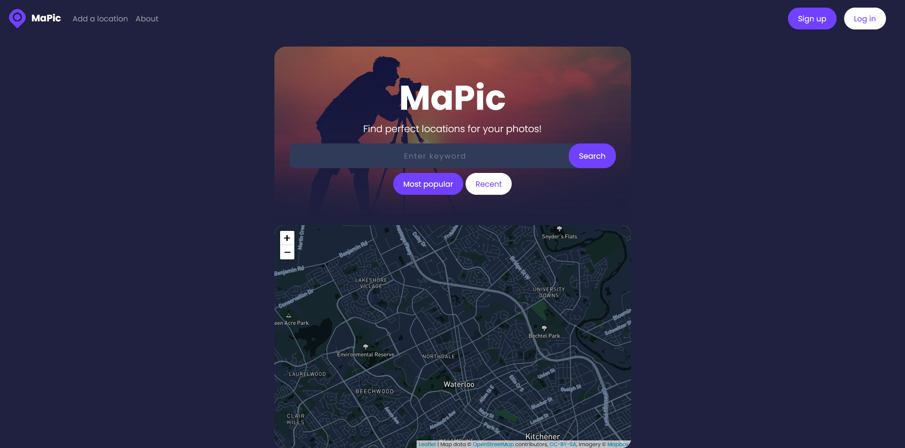

# MaPic

Mapic is a social photo-sharing app that uses Google Vision to help users find photo-shoot locations. 

Features include: 

- Custom sort & rank algorithm to determine best photo‑shoot locations based on keywords

- Node, Express, and MongoDB used for storage and processing. REST API to connect to front‑end

- User friendly interface created in VUE.JS

- Custom Mongo No-SQL database to store post objects, location objects, user objects, comment objects, etc.

## Pictures

